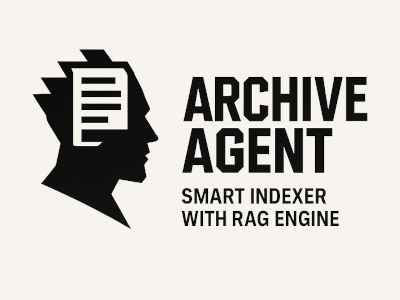

# Archive Agent

**Smart Indexer with [RAG](https://en.wikipedia.org/wiki/Retrieval-augmented_generation) Engine**

**Archive Agent** tracks your files and folders, syncs changes, and powers smart queries.  



---

## Tech Stack

- OpenAI API for embeddings and intelligence
- Qdrant *(running locally)* for storage and search 

## Supported OS

- Tested with Ubuntu 24.04

## Install Requirements

- [Docker](https://docs.docker.com/engine/install/) *(for running Qdrant container)*
- [Python](https://www.python.org/downloads/) **>= 3.9** *(core runtime)*
- [Poetry](https://python-poetry.org/docs/#installation) *(dependency management)*

---

## Export OpenAI API key

Run this once, replacing `sk-...` with your actual [OpenAI API key](https://platform.openai.com/api-keys):

```bash
echo "export OPENAI_API_KEY='sk-...'" >> ~/.bashrc && source ~/.bashrc
```

This will persist the export for the current user, so you don't have to execute it every time.

**NOTE:** Embeddings and queries will incur OpenAI API token costs. Use at your own risk.

---

## Install Archive Agent

Install **Archive Agent** wherever you choose:

```bash
git clone https://github.com/shredEngineer/Archive-Agent
cd Archive-Agent
poetry install
chmod +x *.sh
echo "alias archive-agent='$(pwd)/archive-agent.sh'" >> ~/.bashrc && source ~/.bashrc
```

This creates a global `archive-agent` command via shell script.

---

## Setup Qdrant

**IMPORTANT:** To manage Docker without root, run this once **and reboot**:

```bash
sudo usermod -aG docker $USER
```

Then launch Qdrant with persistent storage and auto-restart, downloading the image on the first run:

```bash
./ensure-qdrant.sh
```

---

## Run Archive Agent

### Usage info

```bash
archive-agent
```

Displays available commands.

### Initialize settings

```bash
archive-agent init
```

Creates default `config.json` and `watchlist.json`.

### Watch files and folders

```bash
archive-agent watch <PATTERN>
```

You can specify more than one pattern or path (e.g., `*.txt`, `/path/foo`).

### Unwatch files and folders

```bash
archive-agent unwatch <PATTERN>
```

You can specify more than one pattern or path (e.g., `*.txt`, `/path/foo`).

Unwatch a file to exclude it from a watched folder.

### List your files and folders

```bash
archive-agent list
```

Displays list of watched files and folders.

### Commit your files and folders

```bash
archive-agent commit
```

Detects changes, updates watchlist, and syncs Qdrant database (adds, updates, or removes entries).

### Search your files and folders

```bash
archive-agent search "Which files mention donuts?"
```

Lists paths matching the question.

### Query your files and folders

```bash
archive-agent query "Which files mention donuts?"
```

Answers your question using RAG.

---

## Storage

### Archive Agent settings

Your **Archive Agent** settings are stored in `~/.archive-agent/settings/`. 

- `config.json`: Your configuration; customizable if you know what you're doing.
- `watchlist.json`: Your watchlist; managed via the `watch` / `unwatch` commands.

### Qdrant database

Your Qdrant database is stored in `~/.archive-agent/qdrant_storage/`.

Visit your [Qdrant dashboard](http://localhost:6333/dashboard#/collections) to manage collections and snapshots.

---

## License: GNU GPL v3.0

Copyright © 2025 Dr.-Ing. Paul Wilhelm <[paul@wilhelm.dev](mailto:paul@wilhelm.dev)>

```
This program is free software: you can redistribute it and/or modify
it under the terms of the GNU General Public License as published by
the Free Software Foundation, either version 3 of the License, or
(at your option) any later version.
```

See [LICENSE](LICENSE) for details.
