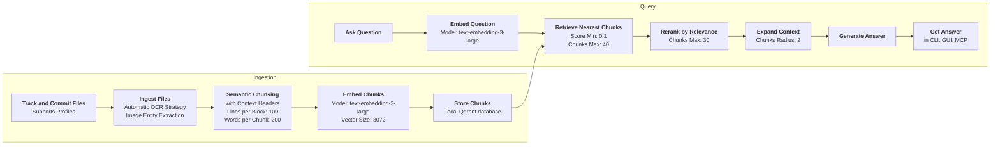
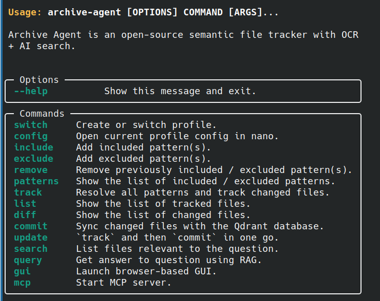
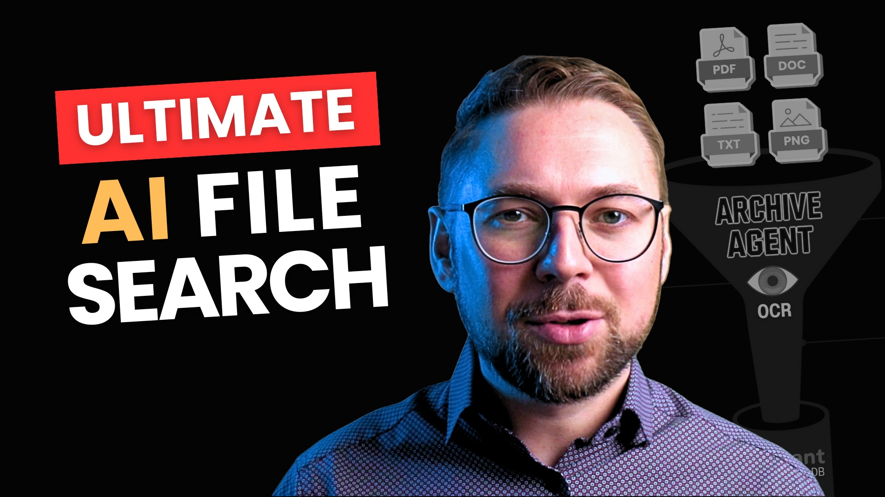

---

# Archive Agent

*An intelligent file indexer with powerful AI search (RAG engine), automatic OCR, and a seamless MCP interface.*


[](https://github.com/Andrew-Jang/RAGHub?tab=readme-ov-file#rag-projects)
[](https://mcphub.com/mcp-servers/shredEngineer/Archive-Agent)
[](https://mcp.so/server/Archive-Agent/shredEngineer)
[](https://mseep.ai/app/499d8d83-02c8-4c9b-9e4f-8e8391395482)
[](https://deepwiki.com/shredEngineer/Archive-Agent)

**Archive Agent** brings RAG to your command line and connects to your tools via MCP — it's *not* a chatbot.

---

## Find what you need with natural language

- **Unlock your documents with semantic AI search & query**
- Files are split using [semantic chunking with context headers](#how-smart-chunking-works) and committed to a local database.
- [RAG engine](#how-chunks-are-retrieved)**¹** uses [reranking and expanding](#how-chunks-are-reranked-and-expanded) of retrieved chunks
 
**¹** *[Retrieval Augmented Generation](https://en.wikipedia.org/wiki/Retrieval-augmented_generation) is the method of matching pre-made snippets of information to a query.*

---

## Natively index your documents on-device

- **Includes local AI file system indexer**
- Natively ingests [PDFs, images, Markdown, plaintext, and more…](#which-files-are-processed)
- [Selects and tracks files using patterns](#how-files-are-selected-for-tracking) like `~/Documents/*.pdf` 
- Transcribes images using [automatic OCR](#ocr-strategies) (experimental) and entity extraction
- Changes are automatically synced to a local [Qdrant](https://qdrant.tech/) vector database.

---

## Your AI, Your Choice

- **Supports many AI providers and MCP** 
- [OpenAI](https://platform.openai.com/docs/overview) or compatible API ¹ for best performance
- [Ollama](https://ollama.com/) and [LM Studio](https://lmstudio.ai/) for best privacy (local LLM)
- Integrates with your workflow** via a built-in [MCP](https://modelcontextprotocol.io/introduction) server.

<small>**¹** Includes [xAI / Grok](https://x.ai/api) and [Claude](https://docs.anthropic.com/en/api/openai-sdk) OpenAI compatible APIs.
Simply adjust the URL [settings](#archive-agent-settings) and overwrite `OPENAI_API_KEY`.</small>

---

## Scalable Performance

- **Fully resumable parallel processing**
- Processes multiple files at once using optimized multi-threading.  
- Uses AI cache and generous request retry logic for all network requests.
- Leverages AI structured output with high-quality prompts and schemas.

---

## Architecture

([If you can't see the diagram below, view it on Mermaid.live](https://mermaid.live/edit#pako:eNqNk29v2jAQxr_KyVLfEZaE8C-qkGhKKS1sLXSbtNEXJrkGi8SJHKeFon732U5gLZu0vUHxPXe_u8c-9iTMIiQ-iQXN1zCdL_mSA5ydwYTHWEiWcbhjOSaMoxaKclVlHmUdBRj-PF8NHgQNN0B5BEGWpkzCFUuwOP-0GpyvxGBR5nkmZAF3InvSwiNY1gAudGVF-5g_LGWWUslC-BLMYSEFlRjvtDJJaYww4pLJHYy2Sgn1JI_VKBcGG2jsAlPKNSFYl3zDeHxgvzC5VkNyiVsJ10gjFIWOT5XNAnIUcJFk4cYHx7Z1_HsmoipuSD64VXymLi_xIc6l5TUdy7XdtmV7luPVswRmlks9yyhdYVSVHy3W5XoKC7UeqRmtlpVQEaNO-IahzAQs2Cv60LK7bs29NNyR8agS8IQ7zUKawH0klHuIqKQrWqApRR4dX_i-RLH7--saqWp1pZsMi42OmQfXTaqnG__29V78p7PaxNhArjVkjlIwfEb4jFToTfjoZxFqjzPGfbCbjo5UOszo1gfProGjClgdrs1hUtHVRWxgtYM5JvhMeYgH8ntO67-edGK4N8b6Nq-W3ezRCXJOI1YWalPquhtTd6vrxshRbzMMefGC4uTO_uysxQdMc11UCrUJTtOpqbeGOq2o8gTIOATTSQPGX9XPLLg7bABpqL87i4gvRYkNkqJIqT6SvU5YErnGFJfEV58RPtEykUuy5G-qTPn9kWXpoVJkZbwm_hNNCnUqc7VqeMmo2qH0GBWqIYogK7kkvuN4XUMh_p5siW85_VbTsdudXrfnui3X7rgNsiN-32t22nbLc9uO2-7Z_d5bg7yaxsq6q9JaTrvf99yO2337BQ1sfns))



---

## Just getting started?

- 👉 [Install Archive Agent on Linux](#install-archive-agent)
- 👉 [Run Archive Agent](#run-archive-agent)
- 👉 [MCP Tools](#mcp-tools)
- 👉 [Update Archive Agent](#update-archive-agent)

---

## Documentation

<!-- TOC -->
* [Archive Agent](#archive-agent)
  * [Find what you need with natural language](#find-what-you-need-with-natural-language)
  * [Natively index your documents on-device](#natively-index-your-documents-on-device)
  * [Your AI, Your Choice](#your-ai-your-choice)
  * [Scalable Performance](#scalable-performance)
  * [Architecture](#architecture)
  * [Just getting started?](#just-getting-started)
  * [Documentation](#documentation)
  * [Supported OS](#supported-os)
  * [Install Archive Agent](#install-archive-agent)
    * [Ubuntu / Linux Mint](#ubuntu--linux-mint)
  * [AI provider setup](#ai-provider-setup)
    * [OpenAI provider setup](#openai-provider-setup)
    * [Ollama provider setup](#ollama-provider-setup)
    * [LM Studio provider setup](#lm-studio-provider-setup)
  * [Which files are processed](#which-files-are-processed)
  * [How files are processed](#how-files-are-processed)
  * [OCR strategies](#ocr-strategies)
  * [How smart chunking works](#how-smart-chunking-works)
  * [How chunk references work](#how-chunk-references-work)
  * [How chunks are retrieved](#how-chunks-are-retrieved)
  * [How chunks are reranked and expanded](#how-chunks-are-reranked-and-expanded)
  * [How answers are generated](#how-answers-are-generated)
  * [How files are selected for tracking](#how-files-are-selected-for-tracking)
  * [Run Archive Agent](#run-archive-agent)
  * [Quickstart on the command line (CLI)](#quickstart-on-the-command-line-cli)
  * [CLI command reference](#cli-command-reference)
    * [See list of commands](#see-list-of-commands)
    * [Create or switch profile](#create-or-switch-profile)
    * [Open current profile config in nano](#open-current-profile-config-in-nano)
    * [Add included patterns](#add-included-patterns)
    * [Add excluded patterns](#add-excluded-patterns)
    * [Remove included / excluded patterns](#remove-included--excluded-patterns)
    * [List included / excluded patterns](#list-included--excluded-patterns)
    * [Resolve patterns and track files](#resolve-patterns-and-track-files)
    * [List tracked files](#list-tracked-files)
    * [List changed files](#list-changed-files)
    * [Commit changed files to database](#commit-changed-files-to-database)
    * [Combined track and commit](#combined-track-and-commit)
    * [Search your files](#search-your-files)
    * [Query your files](#query-your-files)
    * [Launch Archive Agent GUI](#launch-archive-agent-gui)
    * [Start MCP Server](#start-mcp-server)
  * [MCP Tools](#mcp-tools)
  * [Update Archive Agent](#update-archive-agent)
    * [Archive Agent settings](#archive-agent-settings)
      * [Profile configuration](#profile-configuration)
    * [Watchlist](#watchlist)
    * [AI cache](#ai-cache)
  * [Qdrant database](#qdrant-database)
  * [Developer's guide](#developers-guide)
    * [Important modules](#important-modules)
    * [Network and Retry Handling](#network-and-retry-handling)
    * [Code testing and analysis](#code-testing-and-analysis)
    * [Run Qdrant with in-memory storage](#run-qdrant-with-in-memory-storage)
  * [Tools](#tools)
    * [Rename file paths in chunk metadata](#rename-file-paths-in-chunk-metadata)
    * [Remove file paths from context headers](#remove-file-paths-from-context-headers)
  * [Known issues](#known-issues)
  * [Licensed under GNU GPL v3.0](#licensed-under-gnu-gpl-v30)
  * [Collaborators welcome](#collaborators-welcome)
  * [Learn about Archive Agent](#learn-about-archive-agent)
<!-- TOC -->

---

## Supported OS

**Archive Agent** has been tested with these configurations:

- **Ubuntu 24.04** (PC x64)
- **Ubuntu 22.04** (PC x64)

If you've successfully installed and tested **Archive Agent** with a different setup, please let me know and I'll add it here! 

---

## Install Archive Agent

Please install these requirements before proceeding:

- [Docker](https://docs.docker.com/engine/install/) *(for running Qdrant server)*
- [Python](https://www.python.org/downloads/) **>= 3.10** *(core runtime)* (usually already installed)

### Ubuntu / Linux Mint

This installation method should work on any Linux distribution derived from Ubuntu (e.g. Linux Mint). 

To install **Archive Agent** in the current directory of your choice, run this once:

```bash
git clone https://github.com/shredEngineer/Archive-Agent
cd Archive-Agent
chmod +x install.sh
./install.sh
```

The `install.sh` script will execute the following steps:
- Download and install `uv` (used for Python environment management)
- Install the custom Python environment
- Install the `spaCy` model for natural language processing (pre-chunking)
- Install `pandoc` (used for document parsing)
- Download and install the Qdrant docker image with persistent storage and auto-restart
- Install a global `archive-agent` command for the current user

**Archive Agent is now installed!**

👉 **Please complete the [AI provider setup](#ai-provider-setup) next.**  
(Afterward, you'll be ready to [Run Archive Agent](#run-archive-agent)!)

---

## AI provider setup

**Archive Agent** lets you choose between different AI providers:

- Remote APIs *(higher performance and cost, less privacy)*:
  - **OpenAI**: Requires an OpenAI API key.


- Local APIs *(lower performance and cost, best privacy)*:
  - **Ollama**: Requires Ollama running locally.
  - **LM Studio**: Requires LM Studio running locally.

💡 **Good to know:** You will be prompted to choose an AI provider at startup; see: [Run Archive Agent](#run-archive-agent).

📌 **Note:** You *can* customize the specific **models** used by the AI provider in the [Archive Agent settings](#archive-agent-settings). However, you *cannot* change the AI provider of an *existing* profile, as the embeddings will be incompatible; to choose a different AI provider, create a new profile instead.

### OpenAI provider setup

If the OpenAI provider is selected, **Archive Agent** requires the OpenAI API key.

To export your [OpenAI API key](https://platform.openai.com/api-keys), replace `sk-...` with your actual key and run this once:

```bash
echo "export OPENAI_API_KEY='sk-...'" >> ~/.bashrc && source ~/.bashrc
```

This will persist the export for the current user.

💡 **Good to know:** [OpenAI won't use your data for training.](https://platform.openai.com/docs/guides/your-data)

### Ollama provider setup

If the Ollama provider is selected, **Archive Agent** requires Ollama running at `http://localhost:11434`.

- [How to install Ollama.](https://ollama.com/download)

With the default [Archive Agent Settings](#archive-agent-settings), these Ollama models are expected to be installed: 

```bash
ollama pull llama3.1:8b             # for chunk/rerank/query
ollama pull llava:7b-v1.6           # for vision
ollama pull nomic-embed-text:v1.5   # for embed
```

💡 **Good to know:** Ollama also works without a GPU.
At least 32 GiB RAM is recommended for smooth performance.

### LM Studio provider setup

If the LM Studio provider is selected, **Archive Agent** requires LM Studio running at `http://localhost:1234`.

- [How to install LM Studio.](https://lmstudio.ai/download)

With the default [Archive Agent Settings](#archive-agent-settings), these LM Studio models are expected to be installed: 

```bash
meta-llama-3.1-8b-instruct              # for chunk/rerank/query
llava-v1.5-7b                           # for vision
text-embedding-nomic-embed-text-v1.5    # for embed
```

💡 **Good to know:** LM Studio also works without a GPU.
At least 32 GiB RAM is recommended for smooth performance.

---

## Which files are processed

**Archive Agent** currently supports these file types:
- Text:
  - Plaintext: `.txt`, `.md`, `.markdown`
  - Documents:
    - ASCII documents: `.html`, `.htm` (images not supported)
    - Binary documents: `.odt`, `.docx` (including images)
  - PDF documents: `.pdf` (including images; see [OCR strategies](#ocr-strategies))
- Images: `.jpg`, `.jpeg`, `.png`, `.gif`, `.webp`, `.bmp`

📌 **Note:** Images in HTML documents are currently not supported.

📌 **Note:** Legacy `.doc` files are currently not supported.

📌 **Note:** Unsupported files are tracked but not processed.

---

## How files are processed

Ultimately, **Archive Agent** decodes everything to text like this:
- Plaintext files are decoded to UTF-8.
- Documents are converted to plaintext, images are extracted.
- PDF documents are decoded according to the OCR strategy.
- Images are decoded to text using AI vision.
  - Uses OCR, entity extraction, or both combined (default).
  - The vision model will reject unintelligible images.
  - *Entity extraction* extracts structured information from images.
  - Structured information is formatted as image description.

See [Archive Agent settings](#archive-agent-settings): `image_ocr`, `image_entity_extract`

**Archive Agent** processes files with optimized performance:
- **Surgical Synchronization**:
  - PDF analyzing phase is serialized (due to PyMuPDF threading limitations).
  - All other phases (vision, chunking, embedding) run in parallel for maximum performance.
- **Vision operations** are parallelized across images and pages within and across files.
- **Embedding operations** are parallelized across text chunks and files.
- **Smart chunking** uses sequential processing due to carry mechanism dependencies.

See [Archive Agent settings](#archive-agent-settings): `max_workers_ingest`, `max_workers_vision`, `max_workers_embed`

---

## OCR strategies

For PDF documents, there are different OCR strategies supported by **Archive Agent**:

- `strict` OCR strategy (**recommended**):
  - PDF OCR text layer is *ignored*.
  - PDF pages are treated as images and processed with OCR only.
  - **Expensive and slow, but more accurate.**

- `relaxed` OCR strategy:
  - PDF OCR text layer is extracted.
  - PDF foreground images are decoded with OCR, but background images are *ignored*.
  - **Cheap and fast, but less accurate.**

- `auto` OCR strategy:
  - Attempts to select the best OCR strategy for each page, based on the number of characters extracted from the PDF OCR text layer, if any.
  - Decides based on `ocr_auto_threshold`, the minimum number of characters for `auto` OCR strategy to resolve to `relaxed` instead of `strict`.
  - **Trade-off between cost, speed, and accuracy.**

⚠️ **Warning:** The `auto` OCR strategy is still experimental.
PDF documents often contain small/scattered images related to page style/layout which cause overhead while contributing little information or even cluttering the result.

💡 **Good to know:** You will be prompted to choose an OCR strategy at startup (see [Run Archive Agent](#run-archive-agent)).

---

## How smart chunking works

**Archive Agent** processes decoded text like this:
- Decoded text is sanitized and split into sentences.
- Sentences are grouped into reasonably-sized blocks.
- **Each block is split into smaller chunks using an AI model.**
  - Block boundaries are handled gracefully (last chunk carries over).
- Each chunk is prefixed with a *context header* (improves search).
- Each chunk is turned into a vector using AI embeddings.
- Each vector is turned into a *point* with file metadata.
- Each *point* is stored in the Qdrant database.

See [Archive Agent settings](#archive-agent-settings): `chunk_lines_block`, `chunk_words_target`

💡 **Good to know:** This **smart chunking** improves the accuracy and effectiveness of the retrieval.

📌 **Note:** In rare cases where a chunk exceeds the embedding model's token limit (typically 8192 tokens), **Archive Agent** automatically truncates it as a last resort with progressive 10% reductions (up to 10 attempts) until it fits. 

📌 **Note:** Splitting into sentences may take some time for huge documents.
There is currently no possibility to show the progress of this step.

---

## How chunk references work

To ensure that every chunk can be traced back to its origin, **Archive Agent** maps the text contents of each chunk to the corresponding line numbers or page numbers of the source file.

- Line-based files (e.g., `.txt`) use the range of line numbers as reference.
- Page-based files (e.g., `.pdf`) use the range of page numbers as reference.

📌 **Note:** References are only *approximate* due to paragraph/sentence splitting/joining in the chunking process.

---

## How chunks are retrieved

**Archive Agent** retrieves chunks related to your question like this:
- The question is turned into a vector using AI embeddings.
- Points with similar vectors are retrieved from the Qdrant database.
- Only chunks of points with sufficient score are kept.

See [Archive Agent settings](#archive-agent-settings): `retrieve_score_min`, `retrieve_chunks_max`

---

## How chunks are reranked and expanded

**Archive Agent** filters the retrieved chunks .

- Retrieved chunks are reranked by relevance to your question.
- Only the top relevant chunks are kept (the other chunks are discarded).
- Each selected chunk is expanded to get a larger context from the relevant documents.

See [Archive Agent settings](#archive-agent-settings): `rerank_chunks_max`, `expand_chunks_radius`

---

## How answers are generated

**Archive Agent** answers your question using the reranked and expanded chunks like this:
- The LLM receives the chunks as context to the question.
- LLM's answer is returned as structured output and formatted.

💡 **Good to know:** **Archive Agent** uses an answer template that aims to be universally helpful.

---

## How files are selected for tracking

**Archive Agent** uses *patterns* to select your files:

- Patterns can be actual file paths.
- Patterns can be paths containing wildcards that resolve to actual file paths.


- 💡 **Patterns must be specified as (or resolve to) *absolute* paths, e.g. `/home/user/Documents/*.txt` (or `~/Documents/*.txt`).**


- 💡 **Use the wildcard `*` to match any file in the given directory.**


- 💡 **Use the wildcard `**` to match any files and zero or more directories, subdirectories, and symbolic links to directories.**

There are *included patterns* and *excluded patterns*:

- The set of resolved excluded files is removed from the set of resolved included files.
- Only the remaining set of files (included but not excluded) is tracked by **Archive Agent**. 
- Hidden files are always ignored!

This approach gives you the best control over the specific files or file types to track.

---

## Run Archive Agent

💡 **Good to know:** At startup, you will be prompted to choose the following:
- **Profile name**
- **AI provider** (see [AI Provider Setup](#ai-provider-setup))
- **OCR strategy** (see [OCR strategies](#ocr-strategies))

Screenshot of **command-line** interface (CLI):



---

## Quickstart on the command line (CLI)

For example, to [track](#how-files-are-selected-for-tracking) your documents and images, run this:

```bash
archive-agent include "~/Documents/**" "~/Images/**"
archive-agent update
```

To start the GUI, run this:

```bash
archive-agent 
```

Or, to ask questions from the command line:

```bash
archive-agent query "Which files mention donuts?"
```

---

## CLI command reference

### See list of commands

To see the list of supported commands, run this:

```bash
archive-agent
```

### Create or switch profile

To switch to a new or existing profile, run this:

```bash
archive-agent switch "My Other Profile"
```

📌 **Note:** **Always use quotes** for the profile name argument,
**or skip it** to get an interactive prompt.

💡 **Good to know:** Profiles are useful to manage *independent* Qdrant collections (see [Qdrant database](#qdrant-database)) and [Archive Agent settings](#archive-agent-settings).

### Open current profile config in nano

To open the current profile's config (JSON) in the `nano` editor, run this:

```bash
archive-agent config
```

See [Archive Agent settings](#archive-agent-settings) for details.

### Add included patterns

To add one or more included [patterns](#how-files-are-selected-for-tracking), run this:

```bash
archive-agent include "~/Documents/*.txt"
```

📌 **Note:** **Always use quotes** for the pattern argument (to prevent your shell's wildcard expansion),
**or skip it** to get an interactive prompt.

### Add excluded patterns

To add one or more excluded [patterns](#how-files-are-selected-for-tracking), run this:

```bash
archive-agent exclude "~/Documents/*.txt"
```

📌 **Note:** **Always use quotes** for the pattern argument (to prevent your shell's wildcard expansion),
**or skip it** to get an interactive prompt.

### Remove included / excluded patterns

To remove one or more previously included / excluded patterns, run this:

```bash
archive-agent remove "~/Documents/*.txt"
```

📌 **Note:** **Always use quotes** for the pattern argument (to prevent your shell's wildcard expansion),
**or skip it** to get an interactive prompt.

### List included / excluded patterns

To see the list of included / excluded patterns, run this: 

```bash
archive-agent patterns
```

### Resolve patterns and track files

To resolve all patterns and track changes to your files, run this:

```bash
archive-agent track
```

### List tracked files

To see the list of tracked files, run this: 

```bash
archive-agent list
```

📌 **Note:** Don't forget to `track` your files first.

### List changed files

To see the list of changed files, run this: 

```bash
archive-agent diff
```

📌 **Note:** Don't forget to `track` your files first.

### Commit changed files to database

To sync changes to your files with the Qdrant database, run this:

```bash
archive-agent commit
```

To see additional information (vision, chunking, embedding), pass the `--verbose` option.

To bypass the [AI cache](#ai-cache) (vision, chunking, embedding) for this commit, pass the `--nocache` option.

To automatically confirm deleting untracked files from the database, pass the `--confirm-delete` option.

💡 **Good to know:** Changes are triggered by:
- File added
- File removed
- File changed:
  - Different file size
  - Different modification date

The Qdrant database is updated after all files have been ingested. 

📌 **Note:** Don't forget to `track` your files first.

### Combined track and commit

To `track` and then `commit` in one go, run this:

```bash
archive-agent update
```

To see additional information (vision, chunking, embedding), pass the `--verbose` option.

To bypass the [AI cache](#ai-cache) (vision, chunking, embedding) for this commit, pass the `--nocache` option.

To automatically confirm deleting untracked files from the database, pass the `--confirm-delete` option.

### Search your files

```bash
archive-agent search "Which files mention donuts?"
```

Lists files relevant to the question.

📌 **Note:** **Always use quotes** for the question argument, **or skip it** to get an interactive prompt.

To see additional information (embedding, retrieval, reranking), pass the `--verbose` option.

To bypass the [AI cache](#ai-cache) (embedding, reranking) for this search, pass the `--nocache` option.

### Query your files

```bash
archive-agent query "Which files mention donuts?"
```

Answers your question using RAG.

📌 **Note:** **Always use quotes** for the question argument, **or skip it** to get an interactive prompt.

To see additional information (embedding, retrieval, reranking, querying), pass the `--verbose` option.

To bypass the [AI cache](#ai-cache) (embedding, reranking) for this query, pass the `--nocache` option.

To save the query results to a JSON file, run either:

- `--to-json` with a specific filename:
  ```bash
  archive-agent query "Which files mention donuts?" --to-json answer.json
  ```

- `--to-json-auto [DIR]` to auto-generate a clean filename from the question
  (max 160 chars, truncated with `[...]` if needed)
  and write to directory `DIR` if provided (defaults to current directory `.`; creates directories in path if not existing):
  ```bash
  archive-agent query "Which files mention donuts?" --to-json-auto Output/
  # Creates: Output/Which_files_mention_donuts_.json
  ```

📌 **Note:** As of **Archive Agent** v12.2.0, a corresponding Markdown file (`.md`) containing the answer is also created when using the `--to-json` or `--to-json-auto` options. (There is currently no way to opt out of this.)   

### Launch Archive Agent GUI

To launch the **Archive Agent** GUI in your browser, run this:

```bash
archive-agent gui
```

To see additional information (embedding, retrieval, reranking, querying), pass the `--verbose` option.

To bypass the [AI cache](#ai-cache) (embedding, reranking) for this query, pass the `--nocache` option.

To save the query results to JSON files, run this:

- `--to-json-auto [DIR]` to auto-generate clean filenames from the questions
  (max 160 chars, truncated with `[...]` if needed)
  and write to directory `DIR` if provided (defaults to current directory `.`; creates directories in path if not existing):
  ```bash
  archive-agent gui --to-json-auto Output/
  ```

📌 **Note:** As of **Archive Agent** v12.2.0, corresponding Markdown files (`.md`) containing the answers are also created when using the `--to-json-auto` option. (There is currently no way to opt out of this.)   

📌 **Note:** Press `CTRL+C` in the console to close the GUI server.

### Start MCP Server

To start the **Archive Agent** MCP server, run this:

```bash
archive-agent mcp
```

To see additional information (embedding, retrieval, reranking, querying), pass the `--verbose` option.

To bypass the [AI cache](#ai-cache) (embedding, reranking) for this query, pass the `--nocache` option.

To save the query results to JSON files, run this:

- `--to-json-auto [DIR]` to auto-generate clean filenames from the questions
  (max 160 chars, truncated with `[...]` if needed)
  and write to directory `DIR` if provided (defaults to current directory `.`; creates directories in path if not existing):
  ```bash
  archive-agent mcp --to-json-auto Output/
  ```

📌 **Note:** As of **Archive Agent** v12.2.0, corresponding Markdown files (`.md`) containing the answers are also created when using the `--to-json-auto` option. (There is currently no way to opt out of this.)

📌 **Note:** Press `CTRL+C` in the console to close the MCP server.

💡 **Good to know:** Use these MCP configurations to let your IDE or AI extension automate **Archive Agent**:

- [`.vscode/mcp.json`](.vscode/mcp.json) for [GitHub Copilot agent mode (VS Code)](https://code.visualstudio.com/blogs/2025/02/24/introducing-copilot-agent-mode): 
- [`.roo/mcp.json`](.roo/mcp.json) for [Roo Code (VS Code extension)](https://marketplace.visualstudio.com/items?itemName=RooVeterinaryInc.roo-cline)

---

## MCP Tools

**Archive Agent** exposes these tools via MCP:

| MCP tool            | Equivalent CLI command(s) | Argument(s) | Implementation | Description                                     |
|---------------------|---------------------------|-------------|----------------|-------------------------------------------------|
| `get_patterns`      | `patterns`                | None        | Synchronous    | Get the list of included / excluded patterns.   |
| `get_files_tracked` | `track` and then `list`   | None        | Synchronous    | Get the list of tracked files.                  |
| `get_files_changed` | `track` and then `diff`   | None        | Synchronous    | Get the list of changed files.                  |
| `get_search_result` | `search`                  | `question`  | Asynchronous   | Get the list of files relevant to the question. |
| `get_answer_rag`    | `query`                   | `question`  | Asynchronous   | Get answer to question using RAG.               |

📌 **Note:** These commands are **read-only**, preventing the AI from changing your Qdrant database.

💡 **Good to know:** Just type `#get_answer_rag` (e.g.) in your IDE or AI extension to call the tool directly.

💡 **Good to know:** The `#get_answer_rag` output follows the `QuerySchema` format defined in [`AiQuery.py`](archive_agent/ai/query/AiQuery.py).

---

## Update Archive Agent

This step is not immediately needed if you just installed Archive Agent.
However, to get the latest features, you should update your installation regularly.

To update your **Archive Agent** installation, run this in the installation directory:

```bash
./update.sh
```

📌 **Note:** If updating doesn't work, try removing the installation directory and then [Install Archive Agent](#install-archive-agent) again.
Your config and data are safely stored in another place;
see [Archive Agent settings](#archive-agent-settings) and [Qdrant database](#qdrant-database) for details.

💡 **Good to know:** To also update the Qdrant docker image, run this:

```bash
sudo ./manage-qdrant.sh update
```

---

### Archive Agent settings

**Archive Agent** settings are organized as profile folders in `~/.archive-agent-settings/`.

E.g., the `default` profile is located in `~/.archive-agent-settings/default/`.

The currently used profile is stored in `~/.archive-agent-settings/profile.json`.

📌 **Note:** To delete a profile, simply delete the profile folder.
This will not delete the Qdrant collection (see [Qdrant database](#qdrant-database)).

#### Profile configuration

The profile configuration is contained in the profile folder as `config.json`.

💡 **Good to know:** Use the `config` CLI command to open the current profile's config (JSON) in the `nano` editor (see [Open current profile config in nano](#open-current-profile-config-in-nano)).

💡 **Good to know:** Use the `switch` CLI command to switch to a new or existing profile (see [Create or switch profile](#create-or-switch-profile)).

| Key                    | Description                                                                                      |
|------------------------|--------------------------------------------------------------------------------------------------|
| `config_version`       | Config version                                                                                   |
| `mcp_server_host`      | MCP server host (default `http://127.0.0.1`; set to `http://0.0.0.0` to expose in LAN)           |
| `mcp_server_port`      | MCP server port (default `8008`)                                                                 |
| `ocr_strategy`         | OCR strategy in [`DecoderSettings.py`](archive_agent/config/DecoderSettings.py)                  |
| `ocr_auto_threshold`   | Minimum number of characters for `auto` OCR strategy to resolve to `relaxed` instead of `strict` |
| `image_ocr`            | Image handling: `true` enables OCR, `false` disables it.                                         |
| `image_entity_extract` | Image handling: `true` enables entity extraction, `false` disables it.                           |
| `chunk_lines_block`    | Number of lines per block for chunking                                                           |
| `chunk_words_target`   | Target number of words per chunk                                                                 |
| `qdrant_server_url`    | URL of the Qdrant server                                                                         |
| `qdrant_collection`    | Name of the Qdrant collection                                                                    |
| `retrieve_score_min`   | Minimum similarity score of retrieved chunks (`0`...`1`)                                         |
| `retrieve_chunks_max`  | Maximum number of retrieved chunks                                                               |
| `rerank_chunks_max`    | Number of top chunks to keep after reranking                                                     |
| `expand_chunks_radius` | Number of preceding and following chunks to prepend and append to each reranked chunk            |
| `max_workers_ingest`   | Maximum number of files to process in parallel, creating one thread for each file                |
| `max_workers_vision`   | Maxmimum number of parallel vision requests **per file**, creating one thread per request        |
| `max_workers_embed`    | Maxmimum number of parallel embedding requests **per file**, creating one thread per request     |
| `ai_provider`          | AI provider in [`ai_provider_registry.py`](archive_agent/ai_provider/ai_provider_registry.py)    |
| `ai_server_url`        | AI server URL                                                                                    |
| `ai_model_chunk`       | AI model used for chunking                                                                       |
| `ai_model_embed`       | AI model used for embedding                                                                      |
| `ai_model_rerank`      | AI model used for reranking                                                                      |
| `ai_model_query`       | AI model used for queries                                                                        |
| `ai_model_vision`      | AI model used for vision (`""` disables vision)                                                  |
| `ai_vector_size`       | Vector size of embeddings (used for Qdrant collection)                                           |
| `ai_temperature_query` | Temperature of the query model (ignored for GPT-5)                                               |

📌 **Note:** When using GPT-5 (default as of **Archive Agent** v14.0.0), `ai_temperature_query` is ignored.
GPT-5 reasoning effort and verbosity are currently not available in the configuration,
but may be customized directly inside `OpenAiProvider.py`.

📌 **Note:** Since `max_workers_vision` and `max_workers_embed` requests are processed in parallel **per file**,
and `max_workers_ingest` files are processed in parallel, the total number of requests multiplies quickly.
Adjust according to your system resources and in alignment with your AI provider's rate limits.

### Watchlist

The profile watchlist is contained in the profile folder as `watchlist.json`.

The watchlist is managed by these commands only:

- `include` / `exclude` / `remove`
- `track` / `commit` / `update`

### AI cache

Each profile folder also contains an `ai_cache` folder.

The AI cache ensures that, in a given profile:
- The same image is only OCR-ed once.
- The same text is only chunked once.
- The same text is only embedded once.
- The same combination of chunks is only reranked once.

This way, **Archive Agent** can quickly resume where it left off if a commit was interrupted.

To bypass the AI cache for a single commit, pass the `--nocache` option to the `commit` or `update` command
(see [Commit changed files to database](#commit-changed-files-to-database) and [Combined track and commit](#combined-track-and-commit)).

💡 **Good to know:** Queries are never cached, so you always get a fresh answer. 

📌 **Note:** To clear the entire AI cache, simply delete the profile's cache folder.

📌 **Technical Note:** **Archive Agent** keys the cache using a composite hash made from the text/image bytes, and of the AI model names for chunking, embedding, reranking, and vision.
Cache keys are deterministic and change generated whenever you change the *chunking*, *embedding* or *vision* AI model names.
Since cache entries are retained forever, switching back to a prior combination of AI model names will again access the "old" keys.  

---

## Qdrant database

The [Qdrant](https://qdrant.tech/) database is stored in `~/.archive-agent-qdrant-storage/`.

📌 **Note:** This folder is created by the Qdrant Docker image running as root.

💡 **Good to know:** Visit your [Qdrant dashboard](http://localhost:6333/dashboard#/collections) to manage collections and snapshots.

---

## Developer's guide

**Archive Agent** was written from scratch for educational purposes (on either end of the software).

💡 **Good to know:** Tracking the `test_data/` gets you started with *some* kind of test data. 

### Important modules

To get started, check out these epic modules:

- Files are processed in [`archive_agent/data/FileData.py`](archive_agent/data/FileData.py)
- The app context is initialized in [`archive_agent/core/ContextManager.py`](archive_agent/core/ContextManager.py)
- The default config is defined in [`archive_agent/config/ConfigManager.py`](archive_agent/config/ConfigManager.py)  
- The CLI commands are defined in [`archive_agent/__main__.py`](archive_agent/__main__.py)
- The commit logic is implemented in [`archive_agent/core/CommitManager.py`](archive_agent/core/CommitManager.py)
- The CLI verbosity is handled in [`archive_agent/util/CliManager.py`](archive_agent/core/CliManager.py)
- The GUI is implemented in [`archive_agent/core/GuiManager.py`](archive_agent/core/GuiManager.py)
- The AI API prompts for chunking, embedding, vision, and querying are defined in [`archive_agent/ai/AiManager.py`](archive_agent/ai/AiManager.py) 
- The AI provider registry is located in [`archive_agent/ai_provider/ai_provider_registry.py`](archive_agent/ai_provider/ai_provider_registry.py)

If you miss something or spot bad patterns, feel free to contribute and refactor!

### Network and Retry Handling

Archive Agent implements comprehensive retry logic with exponential backoff to handle transient failures:

- **AI Provider Operations**: 10 retries with exponential backoff (max 60s delay) for network timeouts and API errors.
- **Database Operations**: 10 retries with exponential backoff (max 10s delay) for Qdrant connection issues  .
- **Schema Validation**: Additional 10 linear retry attempts for AI response parsing failures with cache invalidation.
- **Dual-Layer Strategy**: Network-level retries handle infrastructure failures, while schema-level retries handle AI response quality issues.

This robust retry system ensures reliable operation even with unstable network conditions or intermittent service issues.

### Code testing and analysis

To run unit tests, check types, and check style, run this:

```bash
./audit.sh
```

### Run Qdrant with in-memory storage

To run Qdrant with in-memory storage (e.g., in OpenAI Codex environment where Docker is not available),
export this environment variable before running `install.sh` and `archive-agent`:

```bash
export ARCHIVE_AGENT_QDRANT_IN_MEMORY=1
``` 

- The environment variable is checked by `install.sh` to skip `manage-qdrant.sh`.
- The environment variable is checked by `QdrantManager.py` to ignore server URL and use in-memory storage instead.

📌 **Note:** Qdrant in-memory storage is volatile (not persisted to disk).

---

## Tools

### Rename file paths in chunk metadata

To bulk-rename file paths in chunk metadata in the currently active Qdrant collection, run this:

```bash
cd tools/

./qdrant-rename-paths-in-chunk-metadata.py
# OR
uv run python qdrant-rename-paths-in-chunk-metadata.py
```

Useful after moving files or renaming folders when you don't want to run the `update` command again.

📌 **Note:**
- This tool modifies the Qdrant database directly — **ensure you have backups if working with critical data**.
- This tool will **not** update the tracked files. You need to update your watchlist (see [Archive Agent settings](#archive-agent-settings)) using manual search and replace.

### Remove file paths from context headers

**Archive Agent** < v11.0.0 included file paths in the chunk context headers; this was a bad design decision that led to skewed retrieval.

To bulk-remove all file paths in context headers in the currently active Qdrant collection, run this:

```bash
cd tools/

./qdrant-remove-paths-from-chunk-headers.py
# OR
uv run python qdrant-remove-paths-from-chunk-headers.py
```

📌 **Note:**
- This tool modifies the Qdrant database directly — **ensure you have backups if working with critical data**.

---

## Known issues

- [ ] While `track` initially reports a file as *added*, subsequent `track` calls report it as *changed*. 


- [ ] Removing and restoring a tracked file in the tracking phase is currently not handled properly:
  - Removing a tracked file sets `{size=0, mtime=0, diff=removed}`.
  - Restoring a tracked file sets `{size=X, mtime=Y, diff=added}`.
  - Because `size` and `mtime` were cleared, we lost the information to detect a restored file.


- [ ] Unprocessable files are tracked in the watchlist (and attempted to be deleted from the Qdrant database when untracked again)


- [ ] Unprocessable files are shown in the final statistics as being "updated in Qdrant database"


- [ ] AI vision is employed on empty images as well, even though they could be easily detected locally and skipped. 


- [ ] PDF vector images may not convert as expected, due to missing tests. (Using `strict` OCR strategy would certainly help in the meantime.) 


- [ ] Binary document page numbers (e.g., `.docx`) are not supported yet; Microsoft Word document support is experimental.


- [ ] References are only *approximate* due to paragraph/sentence splitting/joining in the chunking process.


- [ ] AI cache does not handle `AiResult` schema migration yet. (If you encounter errors, passing the `--nocache` flag or deleting all AI cache folders would certainly help in the meantime.)


- [ ] Rejected images (e.g., due to OpenAI content filter policy violation) from PDF pages in `strict` OCR mode are currently left empty instead of resorting to text extracted from PDF OCR layer (if any).


- [ ] The spaCy model `en_core_web_md` used for sentence splitting is only suitable for English source text. Multilingual support is missing at the moment.


- [ ] HTML document images are not supported.


- [ ] The behaviour of handling unprocessable files is not customizable yet. Should the user be prompted? Should the entire file be rejected? **Unprocessable images are currently tolerated and replaced by `[Unprocessable image]`.** 


- [ ] GPT-5 reasoning effort and verbosity are currently not available in the configuration.


- [ ] GUI sometimes doesn't react on first button click, needs a second one. (Should migrate to use NiceGUI instead of Streamlit.)

- [ ] Test coverage gaps (core retrieval path): `archive_agent/db/QdrantManager.py` ~54% coverage; `archive_agent/ai/query/AiQuery.py` ~57% coverage; `archive_agent/core/CliManager.py` ~37% coverage. Missing areas include reference repair paths, CLI formatting branches, and edge-case retrieval flows.

---

## Licensed under GNU GPL v3.0

Copyright © 2025 Dr.-Ing. Paul Wilhelm <[paul@wilhelm.dev](mailto:paul@wilhelm.dev)>

```
This program is free software: you can redistribute it and/or modify
it under the terms of the GNU General Public License as published by
the Free Software Foundation, either version 3 of the License, or
(at your option) any later version.
```

See [LICENSE](LICENSE) for details.

---

## Collaborators welcome
You are invited to contribute to this open source project! Feel free to [file issues](https://github.com/shredEngineer/Archive-Agent/issues) and [submit pull requests](https://github.com/shredEngineer/Archive-Agent/pulls) anytime.

---

## Learn about Archive Agent

([Tap to open external link to YouTube playlist](https://youtube.com/playlist?list=PLK0uOAnKcdRQSYnV32GHqV8ZAnKstJ-GU&si=QH4MfEmreVEXoa-q))  
[](https://youtube.com/playlist?list=PLK0uOAnKcdRQSYnV32GHqV8ZAnKstJ-GU&si=QH4MfEmreVEXoa-q)  
