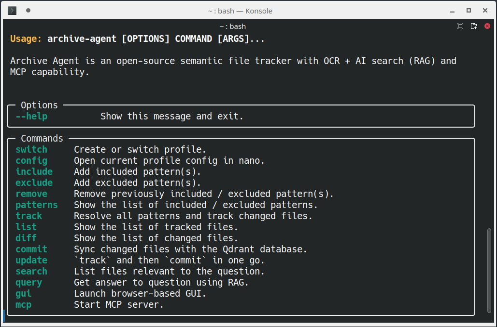

🍀 **[Beta testers welcome!](#-collaborators-welcome)**

---

# 🧠 Archive Agent

**Smart Indexer with [RAG](https://en.wikipedia.org/wiki/Retrieval-augmented_generation) Engine**

- OpenAI API for embeddings and queries
  ([more providers coming soon](https://github.com/shredEngineer/Archive-Agent/issues/6))
- Qdrant *(running locally)* for storage and search 
- Fast and effective semantic chunking (**smart chunking**)


**Archive Agent** tracks your files, syncs changes, and powers smart queries.  

- Supports command-line interface (CLI) using *Typer*
- Supports graphical user interface (GUI) using *Streamlit*

---

⚡ **Looking for the command reference? See: [Run Archive Agent](#-run-archive-agent)**

---

**Screenshot of CLI:**



**Screenshot of GUI:**


[(enlarge screenshot to see details)](archive_agent/assets/Screenshot-GUI.png)

---

## ⚙️ Install Requirements

- [Docker](https://docs.docker.com/engine/install/) *(for running Qdrant server)*
- [Python](https://www.python.org/downloads/) **>= 3.10, < 3.13** *(core runtime)*
- [Poetry](https://python-poetry.org/docs/#installation) *(dependency management)*


- **Tested with Ubuntu 24.04**


- Experimental [install instructions for Mac OS X](macos.md) are available.

---

## ⚙️ Export OpenAI API key

To export your [OpenAI API key](https://platform.openai.com/api-keys), replace `sk-...` with your actual key and run this once:

```bash
echo "export OPENAI_API_KEY='sk-...'" >> ~/.bashrc && source ~/.bashrc
```

This will persist the export for the current user.

**NOTE:** Embeddings and queries will incur AI API token costs. **Use at your own risk.**

💡 **Good to know:** [OpenAI won't use your data for training.](https://platform.openai.com/docs/guides/your-data)

---

## ⚙️ Install Archive Agent

To install **Archive Agent** in the current directory of your choice, run this once:

```bash
git clone https://github.com/shredEngineer/Archive-Agent
cd Archive-Agent
poetry install
poetry run python -m spacy download xx_sent_ud_sm
sudo apt install pandoc
chmod +x *.sh
echo "alias archive-agent='$(pwd)/archive-agent.sh'" >> ~/.bashrc && source ~/.bashrc
```

This will create a global `archive-agent` command for the current user.

📌 **Note:** Complete Qdrant server setup **before** using the `archive-agent` command.

---

## ⚙️ Setup Qdrant server

🚨 **IMPORTANT:** To manage Docker without root, run this once **and reboot**:

```bash
sudo usermod -aG docker $USER
```

To launch Qdrant with persistent storage and auto-restart, run this once:

```bash
./ensure-qdrant.sh
```

This will download the Qdrant docker image on the first run.

📌 **Note:** In case you need to stop the Qdrant Docker image, run this:

```bash
docker stop archive-agent-qdrant-server
```

---

## 🔄 Update Archive Agent

To update your **Archive Agent** installation, run this:

```bash
docker stop archive-agent-qdrant-server
git pull
poetry install
poetry run python -m spacy download xx_sent_ud_sm
docker pull qdrant/qdrant
./ensure-qdrant.sh
```

---

## 🧠 How Archive Agent works

The default settings profile is created on the first run. (See [Storage](#-storage) section.)

### ℹ️ Which files are processed

**Archive Agent** currently supports these file types:
- Text:
  - Plaintext: `.txt`, `.md`
  - Documents:
    - ASCII documents: `.html`, `.htm`
    - Binary documents: `.odt`, `.docx`
      - Embedded images are decoded to text
  - PDF documents: `.pdf`
    - Embedded foreground images are decoded to text
    - Embedded background images are ignored (see note below)
- Images: `.jpg`, `.jpeg`, `.png`, `.gif`, `.webp`, `.bmp`

📌 **Note:** Embedded background images in PDF documents are ignored. This is to avoid redundancy in the chunks generated from scanned documents where the background layer has a corresponding OCR text layer; usually, the OCR text layer already contains (most of) the required information. If you need full-page OCR, enable **strict OCR mode** in the [settings](#-storage). By default, **strict OCR mode** is disabled to save time and tokens for AI vision.

### ℹ️ How files are processed

Ultimately, **Archive Agent** decodes everything to text like this:
- Text files are decoded to UTF-8, regardless of original encoding.
- Non-OCR PDF pages are treated as images.
- Image files are decoded to text using AI vision.
  - The vision model will reject unintelligible images.

Using *Pandoc* for documents, *PyMuPDF4LLM* for PDFs, *Pillow* for images.

📌 **Note:** Unsupported files are tracked but not processed.

### ℹ️ How smart chunking works

**Archive Agent** processes decoded text like this:
- Decoded text is sanitized and split into sentences.
- Sentences are grouped into reasonably-sized blocks.
- **Each block is split into smaller chunks using an AI model.**
  - Block boundaries are handled gracefully (last chunk carries over).
- Each chunk is turned into a vector using AI embeddings.
- Each vector is turned into a *point* with file metadata.
- Each *point* is stored in the Qdrant database.

💡 **Good to know:** This **smart chunking** improves the accuracy and effectiveness of the retrieval. 

### ℹ️ How chunks are retrieved

**Archive Agent** retrieves chunks related to your question like this:
- The question is turned into a vector using AI embeddings.
- Points with similar vectors are retrieved from the Qdrant database.
- Chunks of points with sufficient score are returned.

**Archive Agent** answers your question using retrieved chunks like this:
- The LLM receives the retrieved chunks as context to the question.
- The LLM's answer is returned and formatted.

The LLM's answer is structured to be multi-faceted, making **Archive Agent** a helpful assistant.

### ℹ️ How files are selected for tracking

**Archive Agent** uses *patterns* to select your files:

- Patterns can be actual file paths.
- Patterns can be paths containing wildcards that resolve to actual file paths.
- Patterns must be specified as (or resolve to) *absolute* paths, e.g. `/home/user/Documents/*.txt` (or `~/Documents/*.txt`).
- Patterns may use the wildcard `**` to match any files and zero or more directories, subdirectories, and symbolic links to directories.

There are *included patterns* and *excluded patterns*:

- The set of resolved excluded files is removed from the set of resolved included files.
- Only the remaining set of files (included but not excluded) is tracked by **Archive Agent**. 
- Hidden files are always ignored!

This approach gives you the best control over the specific files or file types to track.

---

## 🚀 Run Archive Agent

### ⚡ List usage info

To show the list of supported commands, run this:

```bash
archive-agent
```

### ⚡ Add included patterns

To add one or more included patterns, run this:

```bash
archive-agent include "~/Documents/*.txt"
```

📌 **Note:** **Always use quotes** for the the pattern argument (to prevent your shell's wildcard expansion),
**or skip it** to get an interactive prompt.

### ⚡ Add excluded patterns

To add one or more excluded patterns, run this:

```bash
archive-agent exclude "~/Documents/*.txt"
```

📌 **Note:** **Always use quotes** for the the pattern argument (to prevent your shell's wildcard expansion),
**or skip it** to get an interactive prompt.

### ⚡ Remove included / excluded patterns

To remove one or more previously included / excluded patterns, run this:

```bash
archive-agent remove "~/Documents/*.txt"
```

📌 **Note:** **Always use quotes** for the the pattern argument (to prevent your shell's wildcard expansion),
**or skip it** to get an interactive prompt.

### ⚡ List included / excluded patterns

To show the list of included / excluded patterns, run this: 

```bash
archive-agent patterns
```

### ⚡ Resolve patterns and track files

To resolve all patterns and track changes to your files, run this:

```bash
archive-agent track
```

### ⚡ List tracked files

To show the full list of tracked files, run this: 

```bash
archive-agent list
```

### ⚡ List changed files

To show the list of changed files, run this: 

```bash
archive-agent diff
```

### ⚡ Commit changed files to database

To sync changes to your files with the Qdrant database, run this:

```bash
archive-agent commit
```

💡 **Good to know:**  Changes are triggered by:
- File added
- File removed
- File changed:
  - Different file size
  - Different modification date

### ⚡ Combined track and commit

To `track` and then `commit` in one go, run this:

```bash
archive-agent update
```

### ⚡ Search your files

```bash
archive-agent search "Which files mention donuts?"
```

Lists files matching the question.

📌 **Note:** **Always use quotes** for the question argument, **or skip it** to get an interactive prompt.

### ⚡ Query your files

```bash
archive-agent query "Which files mention donuts?"
```

Answers your question using RAG.

📌 **Note:** **Always use quotes** for the question argument, **or skip it** to get an interactive prompt.

### ⚡ Launch Archive Agent GUI

To launch the **Archive Agent** GUI in your browser, run this:

```bash
archive-agent gui
```

📌 **Note:** Press `CTRL+C` in the console to close the GUI server.

---

## 📁 Storage

### ℹ️ Archive Agent settings

**Archive Agent** settings are stored in `~/.archive-agent-settings/`. 

The default settings profile is located in `default/`:

- `config.json`:
  - `openai_model_embed`: OpenAI model for embedding
  - `openai_model_query`: OpenAI model for query
  - `openai_model_vision`: OpenAI model for vision (`""` disables vision)
  - `openai_temp_query`: Temperature of query model
  - `qdrant_collection`: Qdrant collection name
  - `qdrant_server_url`: Qdrant server URL
  - `qdrant_vector_size`: Qdrant vector size
  - `qdrant_score_min`: Minimum score of retrieved chunks (`0`...`1`)
  - `qdrant_chunks_max`: Maximum number of retrieved chunks
  - `chunk_lines_block`: Number of lines per block for chunking
  - `ocr_mode_strict`: Enable to treat PDF pages as images (default: `false`)


- `watchlist.json`:
  - Managed via the `include` / `exclude` / `remove` / `track` / `commit` / `update` commands.
  
### ℹ️ Qdrant database

The Qdrant database is stored in `~/.archive-agent-qdrant-storage/`.

📌 **Note:** This folder is created by the Qdrant Docker image running as root.

💡 **Good to know:** Visit your [Qdrant dashboard](http://localhost:6333/dashboard#/collections) to manage collections and snapshots.

---

## 🔬 Testing and code analysis

To run unit tests, check types, and check style, run this:

```bash
./audit.sh
```

---

## 📖 Developer's guide

**Archive Agent** was written from scratch for educational purposes (on either end of the software).

- The app context is initialized in [`archive_agent/core/ContextManager.py`](archive_agent/core/ContextManager.py)
- The default config is defined in [`archive_agent/config/ConfigManager.py`](archive_agent/config/ConfigManager.py)  
- The CLI commands are defined in [`archive_agent/__main__.py`](archive_agent/__main__.py)
- The commit logic is implemented in [`archive_agent/core/CommitManager.py`](archive_agent/core/CommitManager.py)
- The CLI verbosity can be adjusted in [`archive_agent/util/CliManager.py`](archive_agent/util/CliManager.py)
- The GUI is implemented in [`archive_agent/core/GuiManager.py`](archive_agent/core/GuiManager.py)
- The AI API prompts for chunking, embedding, vision, and querying are defined in [`archive_agent/ai/AiManager.py`](archive_agent/ai/AiManager.py) 

If you miss something or spot bad patterns, feel free to contribue and refactor!

💡 **Good to know:** To enable the PDF image debugger window, run this in your current shell:
```bash
export ARCHIVE_AGENT_IMAGE_DEBUGGER=1
```

(PDF image debugger windows must be closed manually in order to proceed.)

---

## 🍀 Collaborators welcome

**You are invited to contribute to this open source project!**

**Feel free to [file issues](https://github.com/shredEngineer/Archive-Agent/issues) and [submit pull requests](https://github.com/shredEngineer/Archive-Agent/pulls) anytime.**

---

## 📝 ToDo

**Archive Agent** is fully functional right now and development is continuing. 

Performance:
- [ ] Implement API request parallel processor for [OpenAI API](https://github.com/openai/openai-cookbook/blob/main/examples/api_request_parallel_processor.py) (or `llamaindex`).

Related to section [Launch Archive Agent GUI](#-launch-archive-agent-gui):
- [ ] Extend GUI functionality beyond queries.

Related to section [Storage](#-storage):
- [ ] Command: Switch profiles (use folder other than `default/`).
- [ ] Save answers to "answers" bucket (feed back).

Chain-of-Thought mechanism:
- [ ] Save follow-up questions to "questions" bucket.
- [ ] Command `auto [N]`: Query random question(s) from question bucket.

Code Quality:
- [ ] Improve test coverage

---

## 🐞 Known bugs

- [ ] While `track` initially reports a file as *added*, subsequent `track` calls report it as *changed*. 


- [ ] Removing and restoring a tracked file in the tracking phase is currently not handled properly:
  - Removing a tracked file sets `{size=0, mtime=0, diff=removed}`.
  - Restoring a tracked file sets `{size=X, mtime=Y, diff=added}`.
  - Because `size` and `mtime` were cleared, we lost the information to detect a restored file.

---

## 📜 License: GNU GPL v3.0

Copyright © 2025 Dr.-Ing. Paul Wilhelm <[paul@wilhelm.dev](mailto:paul@wilhelm.dev)>

```
This program is free software: you can redistribute it and/or modify
it under the terms of the GNU General Public License as published by
the Free Software Foundation, either version 3 of the License, or
(at your option) any later version.
```

See [LICENSE](LICENSE) for details.
